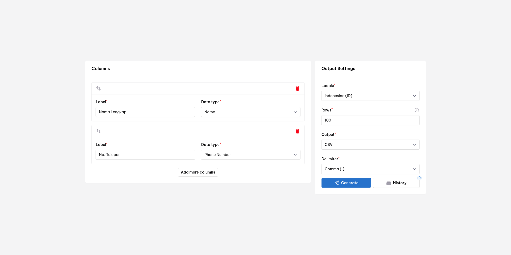
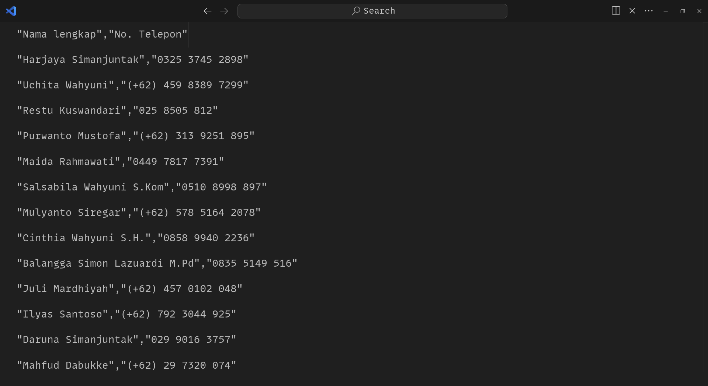

# Data Generator Tool - Generate CSV/XLXS.





This Laravel application allows you to generate synthetic data based on predefined columns and output settings. It is especially useful for testing and development purposes.

## Features

- **Customizable Columns**: Define your own columns with specific data types.
- **Locale Support**: Generate data based on specific locales.
- **Flexible Output**: Export data in various formats such as CSV or Excel (XLXS).
- **Bulk Data Generation**: Generate rows of data based on your input at a time.

## Available Data Types - Generation based on locale

- **Name (Person name)**
- **Email**
- **Password**
- **PhoneNumber**
- **Address**
- **Sentences (Real random text)**
- **Number (Random 2 digit number)**
- **Date**
- **CompanyName**

## Available Locales

- English (US)
- Indonesian (ID)
- German (DE)
- French (FR)
- Spanish (ES)
- Italian (IT)
- Portuguese (PT)
- Russian (RU)
- Japanese (JP)
- Korean (KR)
- Chinese (CN)

## Getting Started

### Prerequisites

- PHP >= 8.2
- Composer

### Installation

1. **Clone the repository**

    ```bash
    git clone https://github.com/akunbeben/csv-excel-generator.git
    cd csv-excel-generator
    ```

2. **Install dependencies**

    ```bash
    composer install
    npm install
    npm run dev
    ```

3. **Copy the example environment file and configure it**

    ```bash
    cp .env.example .env
    php artisan key:generate
    ```

4. **Configure your database settings in the `.env` file (Prefer to use SQLite)**

5. **Run database migrations**

    ```bash
    php artisan migrate
    ```

6. **Serve the application**

    ```bash
    php artisan serve
    ```

    The application will be available at `http://localhost:8000`.

## Usage

### Defining Columns

1. **Add Columns**: Click on "Add more columns" to define the data structure.
2. **Set Labels and Data Types**:
    - **Label**: Label of the column.
    - **Data Type**: Predefined data type for generating data.

### Configuring Output Settings

1. **Locale**: Select the desired locale for locale-specific data generation.
2. **Rows**: Specify the number of rows you wish to generate (e.g., 100).
3. **Output**: Choose the desired output format (e.g., CSV or XLXS).
4. **Delimiter (CSV Only)**: Set the delimiter for the CSV output (e.g., comma).

### Generating Data

Once all settings are configured, click on the "Generate" button to create your data. The generated data will be available for download in the specified format.

## Contributing

We welcome contributions from the community! If you'd like to contribute, please follow these steps:

1. Fork the repository.
2. Create a new branch (`git checkout -b feature-branch`).
3. Make your changes.
4. Commit your changes (`git commit -am 'Add new feature'`).
5. Push to the branch (`git push origin feature-branch`).
6. Create a new Pull Request.

Please make sure your code adheres to the project's coding standards and includes appropriate test coverage.

## Support

For any questions or issues, please contact akunbeben@gmail.com or [Create an Issue ticket](https://github.com/akunbeben/csv-excel-generator/issues).

## License

This project is licensed under the MIT License - see the [LICENSE](LICENSE) file for details.
